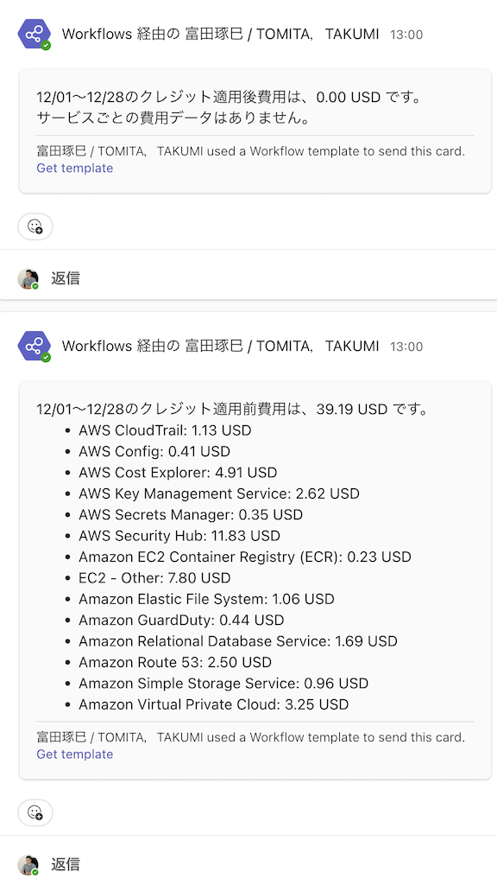

# aws-cost-explore
このリポジトリは、AWS の Cost Explorer を利用して**指定期間の費用・使用状況を取得し、レポートを生成**する Python スクリプトです。  
標準出力および Microsoft Teams Webhook への通知にも対応しています。

## 概要

本スクリプトは以下のようなフローを想定しています:

1. **AWS Cost Explorer** から今月分のコストを取得  
2. クレジット適用前と適用後の費用を計算  
3. サービスごとの費用内訳を整形  
4. **標準出力** と、必要に応じて **Microsoft Teams** (Webhook) へレポート送信  

これにより、AWSコストを手軽に可視化・共有し、不要なコストの早期発見や管理に役立てることができます。

## 前提
- Python 3.8 以上 (推奨)
- AWS CLI または boto3 用の AWS 認証情報が設定されていること  
- （オプション）Microsoft Teams Webhook URL  ※Teams への通知を行う場合に必要

## セットアップ 

1. **リポジトリのクローン**

   ```bash
   git clone https://github.com/<your-org>/<this-repo>.git
   cd this-repo
   ```

2. **仮想環境の作成 & 有効化**

   ```bash
   python -m venv venv
   source venv/bin/activate  # macOS / Linux
   # Windows の場合: venv\Scripts\activate
   ```

3. **依存パッケージをインストール**

   ```bash
   pip install -r requirements.txt
   ```
   - `boto3`, `requests`, `pytest` などがインストールされます。

## 使い方

### 環境変数の設定

- **USE_TEAMS_POST**  
  - `"yes"` の場合は Teams Webhook への投稿を行う。  
  - `"no"` の場合は投稿しない（デフォルト）。
- **TEAMS_WEBHOOK_URL**  
  - Teams 投稿を行う場合の Webhook URL。  
  - `USE_TEAMS_POST="yes"` かつこれが未設定の場合は `ValueError` が発生。

#### 例: `.env` ファイル
```bash
USE_TEAMS_POST=yes
TEAMS_WEBHOOK_URL=https://<your-domain>/workflows/<your-webhook-url>
AWS_ACCESS_KEY_ID="<your-access-key-id>"
AWS_SECRET_ACCESS_KEY="<your-secret-access-key>"
AWS_SESSION_TOKEN="<your-session-token>"
AWS_DEFAULT_REGION=ap-northeast-1
```

### 実行例

```bash
# Teams へ投稿しない（デフォルト）場合
python src/cost_report.py

# Teams へ投稿する場合
export USE_TEAMS_POST=yes
export TEAMS_WEBHOOK_URL="https://<your-domain>/workflows/<your-webhook-url>"
python src/cost_report.py
```

実行後は、標準出力に以下のようなレポートが表示されます。  
`USE_TEAMS_POST=yes` なら同一内容が Teams にも投稿されます。

```
(venv) takumi@iMac aws-cost-explore % python src/cost_report.py
INFO:botocore.credentials:Found credentials in environment variables.
------------------------------------------------------
12/01～12/28のクレジット適用後費用は、0.00 USD です。
サービスごとの費用データはありません。
------------------------------------------------------

------------------------------------------------------
12/01～12/28のクレジット適用前費用は、39.19 USD です。
- AWS CloudTrail: 1.13 USD
- AWS Config: 0.41 USD
- AWS Cost Explorer: 4.91 USD
- AWS Key Management Service: 2.62 USD
- AWS Secrets Manager: 0.35 USD
- AWS Security Hub: 11.83 USD
- Amazon EC2 Container Registry (ECR): 0.23 USD
- EC2 - Other: 7.80 USD
- Amazon Elastic File System: 1.06 USD
- Amazon GuardDuty: 0.44 USD
- Amazon Relational Database Service: 1.69 USD
- Amazon Route 53: 2.50 USD
- Amazon Simple Storage Service: 0.96 USD
- Amazon Virtual Private Cloud: 3.25 USD
------------------------------------------------------
```




## ライセンス

このプロジェクトは [MIT License](./LICENSE) のもとで公開されています。  
詳細は [LICENSE](./LICENSE) ファイルを参照してください。